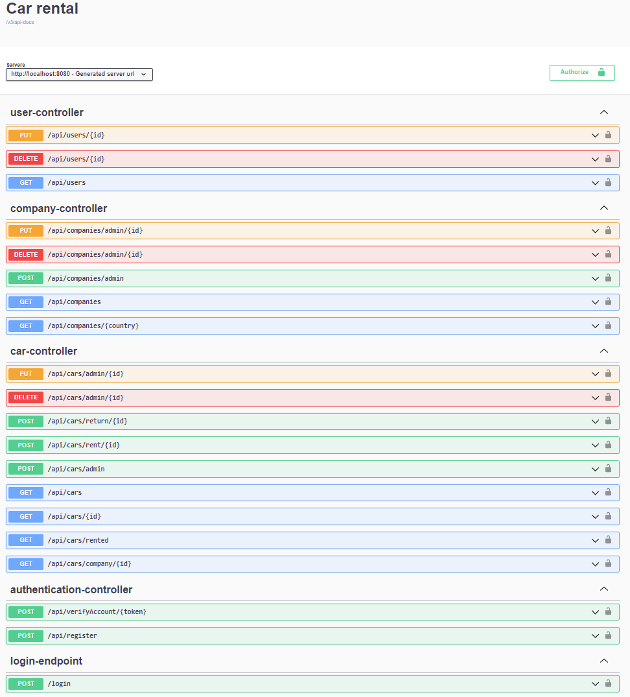

# Car rental

Back-end application for managing car rental offers from many companies.

### Technologies used

- Java 11
- Spring Boot
- Spring Data JPA
- Spring Security
- Spring Validation
- Spring Mail
- Hibernate
- Gradle
- Lombok
- PostgreSQL
- JWT auth
- Junit
- Mockito
- Springdoc OpenAPI

### Main functionalities

- registration with email verification
- receiving JWT when logging in, which is used to user authorization
- populated PostgreSQL database with cars, companies and admin user
- user data input validation
- endpoints access depending on role
- getting data with pagination and sorting
- renting available cars and returning them
- exceptions handling
- implementation of tests with JUnit and Mockito

### Api Documentation

Api documentation with testing server at http://localhost:8080/swagger-ui/index.html with path /v3/api-docs
